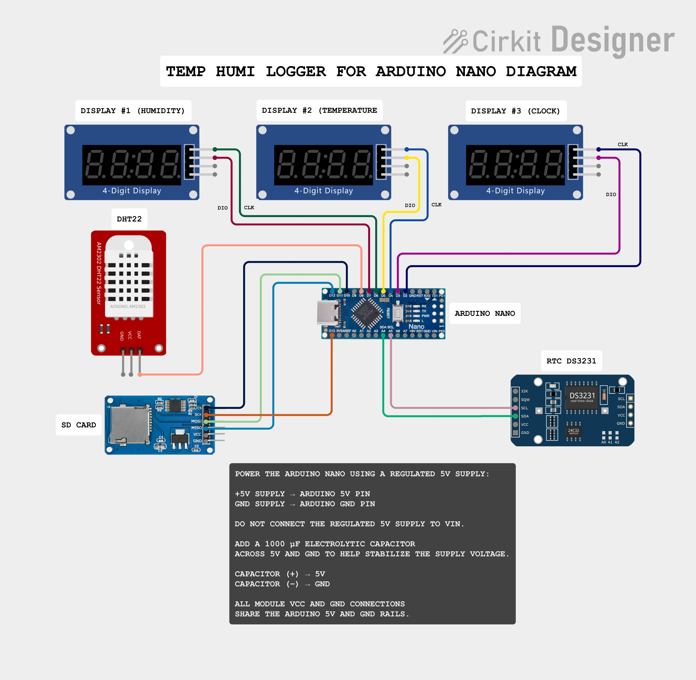

# temp_humi_logger

## Temp/Humi Logger v1.2.3

A reliable Arduino-based Temperature & Humidity Data Logger featuring a DHT22 sensor, DS3231 Real-Time Clock (RTC), MicroSD card logging, and three TM1637 4-digit displays.

Version 1.2.3 focuses on long-run reliability, adding hardware watchdog recovery, I2C timeout protection, independent heartbeat monitoring, low-voltage diagnostics, and improved RTC handling.

---

## Features

* Temperature measurement using DHT22
* Relative humidity measurement
* Accurate timestamps using DS3231 RTC
* Automatic logging to MicroSD card
* Live data display on TM1637 4-digit display
* Non-blocking program architecture using millis()
* Automatic DHT22 retry (maximum 3 attempts)
* CSV-compatible log files
* Improved reliability during sensor read failures

⸻

## What’s New in v1.2.3

### Added

* 8-second hardware watchdog recovery
* Independent main-loop heartbeat on D9
* I2C timeout protection with automatic TWI recovery
* Low-VCC warning below 4.5 V
* RTC timeout detection during logging
* `NA` timestamp logging when RTC data is invalid

### Improved

* Reduced I2C bus speed to 100 kHz for better stability
* Reduced RTC polling frequency to minimize I2C traffic
* Improved long-run reliability and freeze recovery
* Improved separation between sensor, clock, logging, and heartbeat tasks

⸻

## Hardware

* Arduino Uno / Nano (or compatible)
* DHT22 Temperature & Humidity Sensor
* DS3231 RTC Module
* MicroSD Card Module
* TM1637 4-Digit Display
* MicroSD Card
* Jumper wires
* 5V power supply

⸻

## Libraries

This project requires the following Arduino libraries:

- SmartTM1637
- MyDHT22
- RTClib
- SdFat
- Wire (built into the Arduino IDE)
- AVR Watchdog (`avr/wdt.h`, included with the AVR toolchain)

Install the required third-party libraries using the Arduino Library Manager before compiling.

The `Wire` library is included with the Arduino IDE, while `avr/wdt.h` is provided by the AVR core/toolchain and does not require separate installation.
⸻

## Data Logging

Each completed reading cycle is automatically stored on the SD card in CSV format.

The log file contains:

- Date
- Time
- Temperature (°C)
- Humidity (%RH)
- DHT22 status
- RTC status
- SD card status
- Display #1 status
- Display #2 status
- Supply voltage (VCC)

Example of a normal reading:
```text
2026-08-14,14:35:10,29.6,71.8,1,1,1,1,1,4.97
```
If a DHT22 reading fails after all retry attempts, temperature and humidity are recorded as NA:
```text
2026-08-14,14:35:10,NA,NA,0,1,1,0,0,4.97
```
If the RTC reading is invalid or an I2C timeout occurs, the date and time are recorded as NA:
```text
NA,NA,29.6,71.8,1,0,1,1,1,4.97
```

If both the DHT22 and RTC readings fail:
```text
NA,NA,NA,NA,0,0,1,0,0,4.97
```
Status values use:
1 = OK
0 = Failed

Invalid measurement or timestamp fields are stored as NA instead of potentially incorrect data.

⸻

## DHT22 Retry Mechanism

Version 1.2.3 retains and improves the non-blocking DHT22 retry system.

Workflow:

1. Start a new DHT22 reading session.
2. Attempt to read temperature and humidity.
3. If the reading succeeds:
   - Store the latest Temperature and Humidity values.
   - Update the temperature and humidity displays.
   - Set `DHT_OK = 1`.
   - Save the measurement to the SD card.
4. If the reading fails:
   - Wait for the configured retry interval.
   - Retry automatically without blocking the main loop.
5. Maximum retry attempts: **3**.
6. If all retry attempts fail:
   - Record `NA` for Temperature and Humidity.
   - Set `DHT_OK = 0` in the log file.
   - Display an error indication.
   - Continue normal system operation.

The retry process is handled using a non-blocking state-based approach, allowing other tasks such as RTC updates, clock display refresh, heartbeat monitoring, and watchdog servicing to continue running while the DHT22 retry process is active.

This improves long-term reliability by allowing the logger to recover from temporary sensor communication errors without stopping the entire system.

⸻

## Advantages

* Non-blocking sensor retry handling
* Improved multitasking and responsiveness
* Better long-term logging stability
* Automatic recovery from firmware hangs using the hardware watchdog
* Improved I2C reliability with timeout protection
* Independent heartbeat monitoring
* Low-voltage monitoring for easier power diagnostics
* Easier debugging and maintenance
* Ready for future feature expansion

⸻

## Possible Future Improvements

* Serial command interface
* OLED/TFT display support
* Wi-Fi logging (ESP32)
* MQTT support
* Web dashboard
* OTA firmware updates
* Battery monitoring
* Alarm thresholds
* Data statistics
* USB data export

⸻

## Pin Configuration


            +----------------------+
            |   Arduino Uno/Nano   |
            +----------------------+
      D2  ----------------> TM1637 #1 CLK
      D3  ----------------> TM1637 #1 DIO

      D4  ----------------> TM1637 #2 CLK
      D5  ----------------> TM1637 #2 DIO

      D6  ----------------> TM1637 #3 CLK
      D7  ----------------> TM1637 #3 DIO

      D8  ----------------> DHT22 DATA
      D9 -----------------> Heartbeat LED indicator
      D10 ----------------> SD Card CS
      D11 ----------------> SD Card MOSI
      D12 ----------------> SD Card MISO
      D13 ----------------> SD Card SCK

      A4  ----------------> DS3231 SDA
      A5  ----------------> DS3231 SCL

Note

The DS3231 RTC communicates over the I²C bus (A4/A5 on Arduino Uno/Nano), while the MicroSD module uses the hardware SPI interface (D10–D13).

## Wiring Diagram


⸻

## Program Flow

The complete DHT22 loop operation and program flow are documented separately.

[View DHT22 Loop Operation](docs/flowcharts/dht22-loop-operation.md)
⸻

## Version History

### v1.2.3

- Added 8-second hardware watchdog recovery
- Added periodic watchdog servicing in the main loop
- Added I2C timeout protection and automatic TWI recovery
- Reduced I2C bus speed to 100 kHz for improved stability
- Reduced RTC polling frequency to minimize I2C traffic
- Moved heartbeat LED from D13 to D9 to avoid SPI SCK conflict
- Added independent main-loop heartbeat monitoring
- Added low-VCC warning below 4.5 V
- Added RTC timeout detection during logging
- Added `NA` logging for invalid RTC date and time
- Improved long-run stability and freeze recovery

### v1.2.2

- Refactored the non-blocking DHT22 retry mechanism
- Improved code organization and readability
- Improved retry state handling
- Added safer VCC measurement
- Updated CSV header names
- Improved long-term reliability

### v1.2.1

- Introduced DHT22 retry handling
- Added up to three retry attempts
- Improved sensor read reliability

### v1.2.0

- Added supply voltage (VCC) monitoring
- Added display status logging
- Improved SD card logging structure

---

## License

This project is released under the MIT License.

You are free to use, modify, and distribute this project under the terms of the license.

---

## Author

Fadhil Hashim

Embedded Systems • Arduino • Automotive Electronics • Data Logging

---

## Contributing

Contributions, bug reports, and feature suggestions are welcome.

If you find this project useful, consider giving it a ⭐ on GitHub.