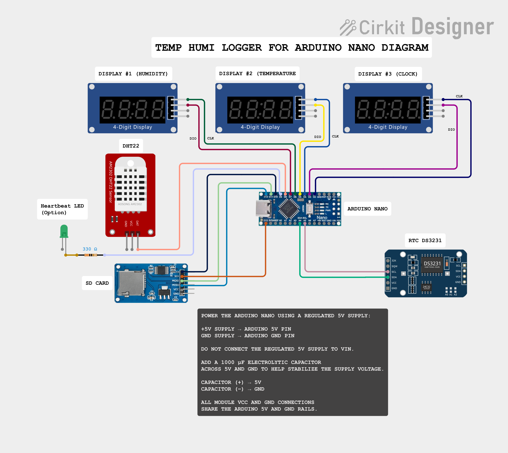

# temp_humi_logger

## Temp/Humi Logger v1.3.0

A reliable Arduino-based Temperature & Humidity Data Logger supporting **DHT22 or SHT41**, DS3231 Real-Time Clock (RTC), MicroSD card logging, and three TM1637 4-digit displays.

Version 1.3.0 introduces **multi-sensor support**, adding the SHT41 as an alternative to the DHT22 while preserving the existing non-blocking architecture and reliability features. This release also improves sensor communication failure handling, SD fail-safe behavior, and SRAM usage.

---

## Features

* Temperature and relative humidity measurement using **DHT22 or SHT41**
* Compile-time sensor selection
* Accurate timestamps using DS3231 RTC
* Automatic logging to MicroSD card
* Live data display on three TM1637 4-digit displays
* Non-blocking program architecture using `millis()`
* Automatic sensor retry with a maximum of 3 attempts
* SHT41 I2C communication failure detection
* Generic `SENSOR_OK` status reporting
* CSV-compatible log files
* 8-second hardware watchdog recovery
* Independent main-loop heartbeat on D9
* I2C timeout protection
* Low-VCC monitoring
* Fail-safe operation during sensor or SD logging failures

---

## Sensor Selection

Version 1.3.0 supports two temperature and humidity sensors:

* DHT22
* SHT41

Select **ONE sensor only** before compiling the firmware.

```cpp
//==========================================================
// ****************** Sensor Selection *********************
//==========================================================
// Select ONE sensor only.
//
// Remove // to ENABLE the sensor.
// Add    // to DISABLE the sensor.
//
// IMPORTANT: Enable only ONE sensor at a time.

//#define SENSOR_DHT22   // DHT22 sensor
#define SENSOR_SHT41     // SHT41 sensor
```

For example, the configuration above enables the **SHT41** and disables the **DHT22**.

---

## What's New in v1.3.0

### Added

* SHT41 temperature and humidity sensor support
* Compile-time selection between DHT22 and SHT41
* SHT41 initialization status checking
* Explicit SHT41 I2C communication failure detection
* SHT41 integration with the existing non-blocking 3-attempt retry mechanism
* Generic `SENSOR_OK` status reporting for supported sensors
* Fail-safe SD handling after a logging failure

### Improved

* Prevented failed SHT41 transactions from producing stale or invalid readings
* Generalized sensor handling for DHT22 and SHT41
* Improved sensor disconnect and recovery behavior
* Sensor, RTC, display, and heartbeat operation continue after an SD logging failure
* Optimized constant Serial strings using `F()` to reduce SRAM usage
* Reduced SRAM usage from approximately **83% to 71%**
* Increased available SRAM from approximately **330 bytes to 578 bytes**
* Improved memory headroom for long-run operation

---

## SD Card Behavior

The MicroSD card is **not hot-swappable** in v1.3.0.

If the SD card is removed or SD logging fails during operation:

* SD logging is disabled
* Temperature and humidity measurement continues
* RTC operation continues
* Displays continue updating
* Main-loop heartbeat continues operating

To resume SD logging:

1. Reinsert the MicroSD card
2. Press the Arduino RESET button
3. The SD card will be initialized again and logging will resume

Automatic SD re-initialization is intentionally not used because repeated SD initialization attempts while the card is unavailable may block the main loop and interfere with display and heartbeat operation.

---

## Reliability Features

The reliability improvements introduced in v1.2.3 remain available in v1.3.0:

* 8-second hardware watchdog recovery
* Independent main-loop heartbeat on D9
* I2C timeout protection with automatic TWI recovery
* I2C bus operating at 100 kHz
* Reduced RTC polling frequency
* Low-VCC warning below 4.5 V
* RTC timeout detection during logging
* `NA` timestamp logging when RTC data is invalid
* CSV device status flags
* Non-blocking sensor retry architecture

---

## Hardware-Tested Failure Handling

The following behaviors have been tested on real hardware:

* DHT22 firmware build — **PASS**
* SHT41 firmware build — **PASS**
* SHT41 normal measurement — **PASS**
* SHT41 disconnect detection — **PASS**
* SHT41 3-attempt retry — **PASS**
* SHT41 reconnection recovery — **PASS**
* SD logging failure detection — **PASS**
* Logger continues operating after SD removal — **PASS**
* SD logging resumes after SD reinsertion and MCU reset — **PASS**

Version 1.3.0 therefore extends the Temp/Humi Logger from a DHT22-specific logger into a more flexible **multi-sensor platform** while maintaining the reliability-oriented architecture introduced in v1.2.3.


⸻

## Hardware

* Arduino Uno / Nano (or compatible)
* Temperature & Humidity Sensor — choose ONE:
  * DHT22 Temperature & Humidity Sensor
  * SHT41 Temperature & Humidity Sensor
* DS3231 RTC Module
* MicroSD Card Module
* MicroSD Card
* TM1637 4-Digit Display 1 — Temperature (dot version)
* TM1637 4-Digit Display 2 — Humidity (dot version)
* TM1637 4-Digit Display 3 — Clock (colon version)
* Jumper wires
* 5V power supply

⸻

## Libraries

This project requires the following Arduino libraries:

### Core Libraries

- SmartTM1637
- RTClib
- SdFat

### Sensor Libraries

Install the library required for the sensor you want to use:

**For DHT22:**
- MyDHT22

**For SHT41:**
- Adafruit SHT4x
- Adafruit Unified Sensor

### Built-in Libraries

- Wire (built into the Arduino IDE)
- AVR Watchdog (`avr/wdt.h`, included with the AVR toolchain)

Install the required third-party libraries using the Arduino Library Manager before compiling.

The `Wire` library is included with the Arduino IDE, while `avr/wdt.h` is provided by the AVR core/toolchain and does not require separate installation.

Only the library for the selected temperature and humidity sensor is included during compilation through the firmware's compile-time sensor selection.
⸻

## Data Logging

Each completed sensor reading cycle is automatically stored on the SD card in CSV format.

The log file contains:

- Date
- Time
- Temperature (°C)
- Humidity (%RH)
- Sensor status (`SENSOR_OK`)
- RTC status (`RTC_OK`)
- SD card status (`SD_OK`)
- Display #1 status (`DISP1_OK`)
- Display #2 status (`DISP2_OK`)
- Supply voltage (`VCC_V`)

Example of a normal reading:
```text
2026-08-26,14:35:10,29.6,71.8,1,1,1,1,1,4.97
```
If the selected sensor (DHT22 or SHT41) fails after all retry attempts, temperature and humidity are recorded as NA:
```
2026-08-26,14:35:10,NA,NA,0,1,1,0,0,4.97
```

If the RTC reading is invalid or an I2C timeout occurs, the date and time are recorded as NA:
```
NA,NA,29.6,71.8,1,0,1,1,1,4.97
```

If both the sensor and RTC readings fail:
```

NA,NA,NA,NA,0,0,1,0,0,4.97
```

Status values use:
```

1 = OK
0 = Failed
```

Invalid sensor measurements or timestamps are stored as NA instead of potentially incorrect data.

Note: The MicroSD card is not hot-swappable in v1.3.0.
If the SD card is removed during operation, logging stops while the sensor, RTC, displays, and heartbeat continue operating. Reinsert the SD card and press RESET to resume logging.

⸻

## Sensor Retry Mechanism

Version 1.3.0 uses a common non-blocking retry mechanism for both supported temperature and humidity sensors:

DHT22
SHT41
Workflow
Start a new sensor reading session.
Attempt to read temperature and humidity.
If the reading succeeds:
Store the latest temperature and humidity values.
Update the temperature and humidity displays.
Set SENSOR_OK = 1.
Save the measurement to the SD card.
If the reading fails:
Wait for the configured retry interval.
Retry automatically without blocking the main loop.
Maximum retry attempts: 3.
If all retry attempts fail:
Record NA for temperature and humidity.
Set SENSOR_OK = 0.
Display an error indication.
Continue normal system operation.
A new sensor reading session will be attempted automatically during the next cycle.

For SHT41, the firmware also checks the result of the I2C communication before accepting the temperature and humidity values. This prevents failed communication from being interpreted as a valid or stale measurement.

The retry process uses a non-blocking state-based approach, allowing other tasks such as RTC updates, clock display refresh, heartbeat monitoring, and watchdog servicing to continue while waiting between sensor retry attempts.

This allows the logger to recover automatically from temporary sensor communication failures without stopping the entire system.

Advantages
Supports both DHT22 and SHT41 sensors
Simple compile-time sensor selection
Common SENSOR_OK status reporting
Non-blocking sensor retry handling
Automatic sensor recovery after temporary communication failures
SHT41 communication failure detection
Protection against stale or invalid SHT41 readings
Improved multitasking and responsiveness
Fail-safe operation after SD logging failure
Hardware watchdog recovery
I2C timeout protection
Independent heartbeat monitoring
Low-voltage monitoring for power diagnostics
Reduced SRAM usage through Flash-stored constant strings
CSV status flags for easier diagnostics
Easier debugging and maintenance
Ready for future sensor and feature expansion

⸻

## Possible Future Improvements

* Serial command interface
* OLED/TFT display support
* Wi-Fi logging (ESP32)
* MQTT support
* Web dashboard
* OTA firmware updates
* Battery monitoring
* Alarm thresholds
* Data statistics
* USB data export

⸻

## Pin Configuration

            +----------------------+
            |   Arduino Uno/Nano   |
            +----------------------+
      D2  ----------------> TM1637 #1 CLK
      D3  ----------------> TM1637 #1 DIO

      D4  ----------------> TM1637 #2 CLK
      D5  ----------------> TM1637 #2 DIO

      D6  ----------------> TM1637 #3 CLK
      D7  ----------------> TM1637 #3 DIO

      D8  ----------------> DHT22 DATA (DHT22 only)
      D9  ----------------> Heartbeat LED indicator

      D10 ----------------> SD Card CS
      D11 ----------------> SD Card MOSI
      D12 ----------------> SD Card MISO
      D13 ----------------> SD Card SCK

      A4  ----------------> DS3231 SDA + SHT41 SDA
      A5  ----------------> DS3231 SCL + SHT41 SCL

Sensor Connections

DHT22
```

D8  ----------------> DHT22 DATA
5V  ----------------> DHT22 VCC
GND ----------------> DHT22 GND
```

SHT41
```

A4  ----------------> SHT41 SDA
A5  ----------------> SHT41 SCL
5V* ----------------> SHT41 VCC
GND ----------------> SHT41 GND
```

Important: Select and use only one temperature/humidity sensor configuration at a time (DHT22 or SHT41).

Notes

The DS3231 RTC and SHT41 communicate over the same I²C bus using A4 (SDA) and A5 (SCL) on the Arduino Uno/Nano.

The MicroSD module uses the Arduino hardware SPI interface:
```
D10 — CS
D11 — MOSI
D12 — MISO
D13 — SCK
```
D8 is only used when the DHT22 configuration is enabled. When SHT41 is selected, D8 is not used by the temperature/humidity sensor.

## Wiring Diagram


⸻

## Program Flow

The complete DHT22 loop operation and program flow are documented separately.

[View DHT22 Loop Operation](docs/flowcharts/dht22-loop-operation.md)
⸻

## Version History

### v1.3.0

- Added SHT41 temperature and humidity sensor support
- Added compile-time sensor selection between DHT22 and SHT41
- Added SHT41 initialization and I2C communication failure detection
- Integrated SHT41 with the existing non-blocking 3-attempt retry mechanism
- Prevented failed SHT41 transactions from producing stale or invalid readings
- Generalized sensor status reporting from `DHT_OK` to `SENSOR_OK`
- Generalized sensor retry and logging logic for multi-sensor operation
- Added fail-safe SD handling after a logging failure
- Logger continues sensor, RTC, display, and heartbeat operation after SD logging failure
- SD logging remains disabled after a card failure until the logger is reset
- Optimized constant Serial strings using `F()` to reduce SRAM usage
- Improved available SRAM and memory headroom
- Preserved watchdog, I2C timeout, heartbeat, RTC, VCC, and CSV diagnostic features from v1.2.3

### v1.2.3

- Added 8-second hardware watchdog recovery
- Added periodic watchdog servicing in the main loop
- Added I2C timeout protection and automatic TWI recovery
- Reduced I2C bus speed to 100 kHz for improved stability
- Reduced RTC polling frequency to minimize I2C traffic
- Moved heartbeat LED from D13 to D9 to avoid SPI SCK conflict
- Added independent main-loop heartbeat monitoring
- Added low-VCC warning below 4.5 V
- Added RTC timeout detection during logging
- Added `NA` logging for invalid RTC date and time
- Improved long-run stability and freeze recovery

### v1.2.2

- Refactored the non-blocking DHT22 retry mechanism
- Improved code organization and readability
- Improved retry state handling
- Added safer VCC measurement
- Updated CSV header names
- Improved long-term reliability

### v1.2.1

- Introduced DHT22 retry handling
- Added up to three retry attempts
- Improved sensor read reliability

### v1.2.0

- Added supply voltage (VCC) monitoring
- Added display status logging
- Improved SD card logging structure

---

## License

This project is released under the MIT License.

You are free to use, modify, and distribute this project under the terms of the license.

---

## Author

Fadhil Hashim

Embedded Systems • Arduino • Automotive Electronics • Data Logging

---

## Contributing

Contributions, bug reports, and feature suggestions are welcome.

If you find this project useful, consider giving it a ⭐ on GitHub.
